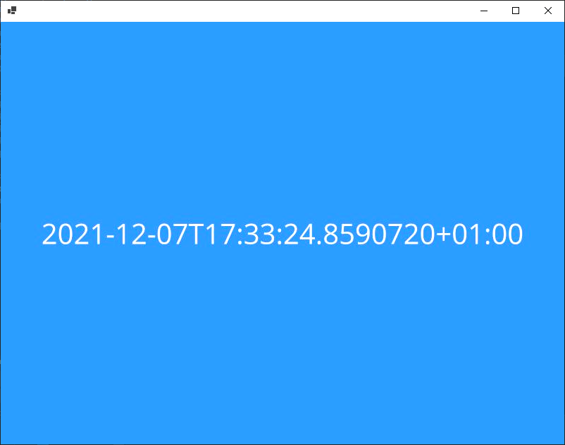

# libvlcsharp-nonfree-samples

Sample projects that took me too much time to create to be offered for free.
I hope that you will find these sample useful, but if you integrate them in your projects, I ask you to pay for a small amount (one-time or monthly) on
[my GitHub sponsor account](https://github.com/sponsors/jeremyVignelles?frequency=one-time)

## About the PipeMediaInput

The [pipe media input](Common/PipeMediaInput.cs) is a custom implementation of `MediaInput` that can be used in situation where you receive data through events.

Simply passing data to a `MemoryStream` and using the built-in `StreamMediaInput` won't work
because VLC consumes data faster than they arrive, and detects incorrectly the end of the stream once all the data has been consumed.

Using a pipe from [the System.IO.Pipelines package](https://www.nuget.org/packages/System.IO.Pipelines/) allows libvlc to wait for data to be available.

See [this blog post](https://devblogs.microsoft.com/dotnet/system-io-pipelines-high-performance-io-in-net/)
and [this doc page](https://docs.microsoft.com/en-us/dotnet/standard/io/pipelines)
to read more about pipe usage.

## ImageSharp used to create frames

[This sample](ImageSharpMjpegInput/) shows how to use the ( [PipeMediaInput](Common/PipeMediaInput.cs) ) to feed the VLC media input.

This sample effectively creates a MJPEG stream (i.e. a continuous stream of JPEG files one after others, playing at a specific frame rate) using ImageSharp to draw images one after the other.

In this sample, the image shows a colored background on which is written the current time (the time at which the frame is sent to libvlc, but libvlc will apply its own delay after that, so it's not an accurate clock.)

